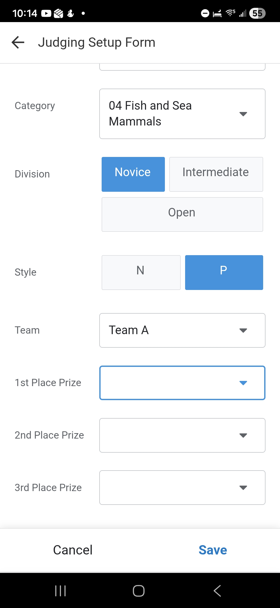
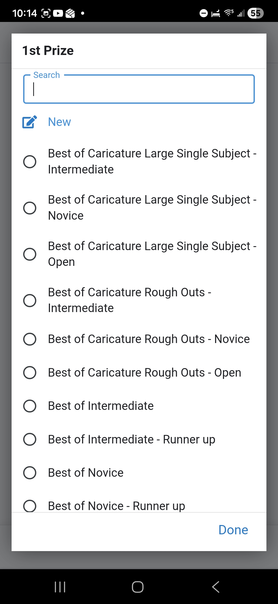

# Assigning Prizes
This guide covers how an **Admin** assigns specific prizes (cash or trophies) to competition categories using the **Setup Judging** list in the Judging module.

## 1. Accessing Setup Judging
1. From the **Main Menu**, select the **Judging** module.
1. Select **Setup Judging** from the submenu.

    

## 2. Finding the Category
- The list displays all competition entries (Division/Category/Style).
- Use the **Search Bar** to find the specific category that needs prize assignments.
- You can also use **Filtering** to narrow down the list by Division or Category.

## 3. Assigning Prizes
1. Once you locate the entry, click the **Row** to open the **Detail View**.
1. Click the **Pencil Icon** to open the edit form.

    

1. **Prize Assignments**: 
    - Find the **1st Place Prize** dropdown and select the appropriate award.
    - Repeat for **2nd Place Prize** and **3rd Place Prize** if applicable.
    - You can search within these dropdowns to find specific prizes (e.g., "Best of Show", "1st Place Ribbon").

    

1. **Save**: Click the **Save** button to commit the changes.
    - *Note: The form will close immediately without a confirmation message.*

## 4. Verification
After saving, the assigned prizes will be visible in the **Detail View** for that category. These assignments ensure that when the **Judging Team** selects a winner, the correct prize is automatically associated with their placement.
