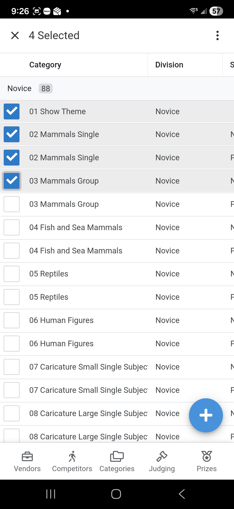
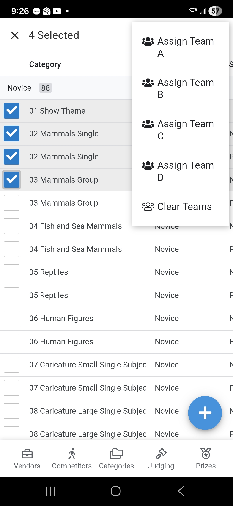

# Assigning Judging Teams
This guide covers how a **Judging Manager** or **Admin** assigns judging teams to competition entries. Assignments can be done individually for a single category or in bulk for multiple categories at once.

## 1. Accessing Setup Judging
1. From the **Main Menu**, select the **Judging** module.
2. Select **Setup Judging** from the submenu.

    

## 2. Bulk Assignment (Multi-Select)
The most efficient way to assign teams is by selecting multiple entries and using the bulk update feature.

1. **Enter Multi-Select Mode**:
    - Click the **Check Box Icon** in the top-right corner of the list.
    - *Alternatively, perform a **Long Press** on any entry in the list.*
1. **Select Entries**: Tap the entries you wish to assign to the same team. A checkmark will appear next to each selected item.

    

1. **Open More Options**: Click the **More Options (⋮ or Menu)** icon in the top header.
1. **Choose Assign Team A, B, C or D**: Select the team you wish to assign to the selected entries.

    

1. *Alternatively, select Clear Team to remove the tem assignments on the selected records.*
1. **Confirm**: A dialog will pop up asking you to confirm the action. Once confirmed the application will update all selected entries with the new team assignment.

## 3. Individual Assignment (Edit Form)
Use this method if you need to update a single entry or modify specific prize information along with the team assignment.

1. Locate the specific **Judging Entry** in the list.
2. Click the **Row** to open the **Detail View**.
3. Click the **Pencil Icon** to open the edit form.
4. **Team Assignment**: Find the **Team** dropdown and select the desired judging team.
5. **Save**: Click the **Save** button to commit the change.
    - *Note: The form will close without a confirmation message.*

## 4. Verification
After assigning teams, you can use the **Filtering** options to view the list by Team. This ensures that no categories have been missed and that the workload is distributed correctly.

   

