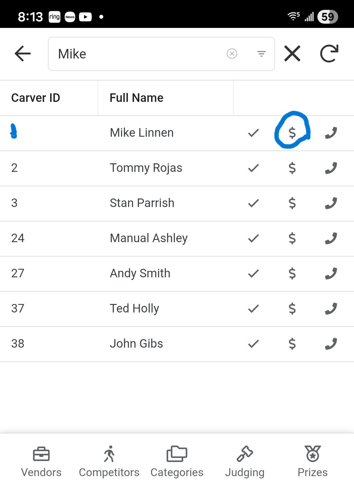
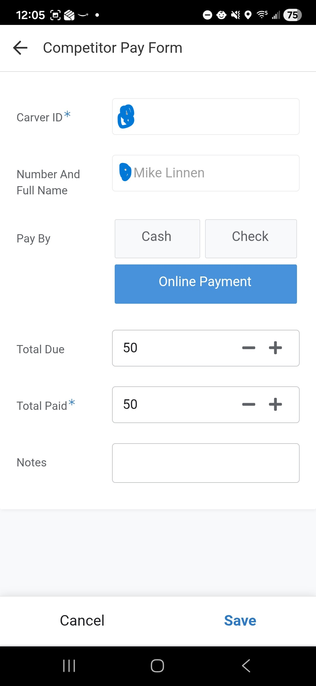

# Carver Payment Verification
This guide covers the workflow for the Finance Team (e.g., Finance Officer) to collect and record payments from competitors.  Payment can be collected before the event by the competitor registering and making a payment online, mailing in a check or paying in cash.  Payment can also be collected the day of the event.  In some cases if a competitor entered in more than 15 carvings then extra payment may need to be collected the day of the event.

## 1. Accessing Competitors
1. From the **Main Menu**, select the **Competitors** module.
2. Select **Competitors** from the submenu.

    

## 2. Finding a Competitor
- A list of all registered competitors will be displayed.
- Use the **Search Bar** to find the competitor by entering their **Carver ID** or **Name**.

    

## 3. Opening the Payment Form
- Once you locate the competitor, look for the **Dollar Sign Icon ($)** on the right side of their row. If the icon is missing then the record is likely a Duplicate one so look for another record that matches the carver you are trying to edit the payment on.
- Click the icon to open the payment details form.

    

## 4. Recording Payment
Follow these steps to record the transaction:

### Fee Calculation
- **Standard Entry Limit**: The base fee covers up to **15 entries**.
- **Additional Fees**: If the competitor has more than 15 entries, they must pay **$3.00 for each additional entry**.
- **Total Due**: Verify the amount. You can manually adjust the **Total Due** field if necessary to reflect these additional fees or other adjustments.

### Payment Details
1. **Pay By**: Select the method of payment:
    - **Cash**
    - **Check**
    - **Online Payment**
2. **Total Paid**: Enter the exact amount the competitor is paying now.
3. **Notes**: Use this field to capture transaction details, such as the **Check Number**.

## 5. Receipts
- **The application does not generate receipts.**
- **Cash/Check**: If the competitor requires a receipt, please write one manually.
- **Credit Card**: If they paid online/via card, an electronic receipt will be automatically sent to the email address on file.

## 6. Finalizing
- Click the **Save** button to record the transaction.
