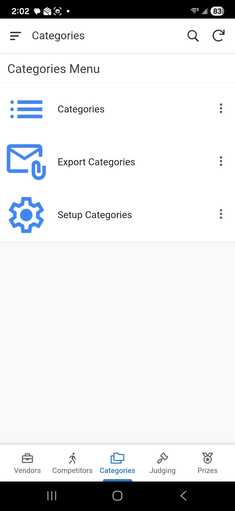

# Categories
The categories setup is one of the most important parts of the event.  Defining these categories drives what is available in the Judging module. Once all the categories are updated for the event then a process can be kicked off manually to generate all the Judging entries.

## 1. Accessing Categories
1. From the **Main Menu**, select the **Categories** module.
2. Select **Categories** from the submenu.

    

This section will cover how to configure competition divisions, categories, and styles.

