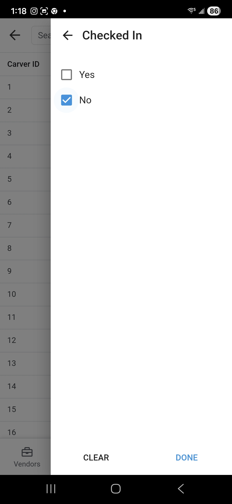
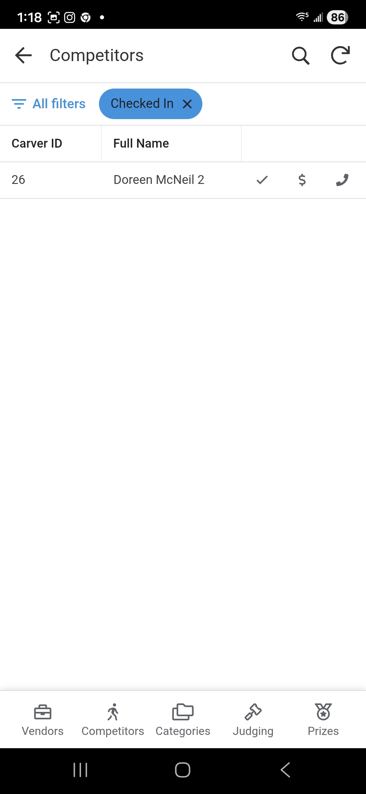
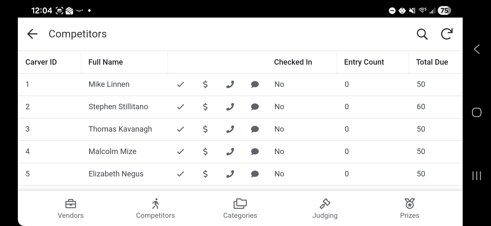
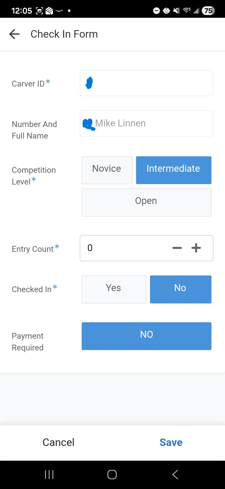

# Check-In Process
This guide covers how to check in a competitor on the day of the event.  It also covers how to undo a check in if the cmopetitor was checked in by mistake.

It is very important that all competitors follow this process of being checked in otherwise their carvings cannot be judged. 

## 1. Accessing Competitors
1. From the **Main Menu**, select the **Competitors** module.
2. Select **Competitors** from the submenu.

    

## 2. Finding a Carver
- A list of all registered competitors will be displayed.
- Use the **Search Bar** to find the carver by entering their **ID** or **Name**.

    
- Another option is to filter the list by Checked In = No

    

    

## 3. Opening the Check-In Form
- Once you locate the carver, look for the **Check Box Icon** on the row. If the icon is missing then the record is likely a Duplicate one so look for another record that matches the carver you are trying to check in.

    
- Click the icon to open the check-in form.

## 4. Completing Check-In
Follow these steps within the form:

1. **Carver ID and Name**: Conform that the carver you are checking in is in fact the one you selected from the list.
1. **Competition Level**: Confirm with the carver there level they are entering in as.  Use the Novice, Intermediate or Open **Radio Buttons** to make any corrections.
1. **Entry Count**: Enter the total number of pieces they are entering today.
1. **Checked In**: Select the **Yes** radio button to toggle their status.  This should automatically be set to Yes for you and you won't be able to leave it as No and save your changes.  So only use the Check-In form to actually check in a person (not look up to see if they are checked in).  Also if you accidently selected the wrong carver to check in simply click the **Cancel** button.
1. **Payment**:
    - Review the **Payment Required** status.
    - If **Payment Required = Yes** or they have more than 15 carvings, direct the carver to the **Finance Officer (Don)** to collect the funds.
1. **Save**: Click the **Save** button to complete the process. 
    - *Note: There is no confirmation message after clicking Save; the form will simply close.*
1. **Cancel**: If you need to exit without saving, click the **Cancel** button.
    - *Note: You will not be prompted for confirmation when canceling.*

## 5. I checked in the wrong person 
This can happen but only an Admin user can reverse the checkin process.  Either contact the admin or if you have user management role you can grant yourself Admin role for a short period of time to mark a person as Checked In = No and Entry Count = 0 on the check in form.  Once you are done doing this make sure you remove your Admin role. 
