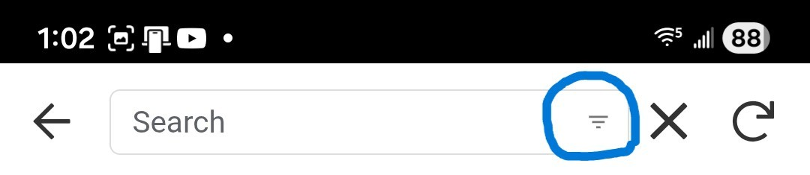
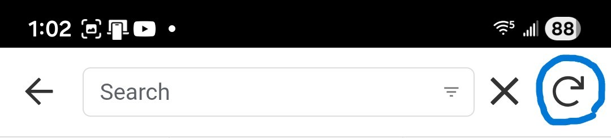

# Common Inteface Elements
This guide explains some of the common user interface elements that are used throught the application no matter what module you are in.

## Common Interface Elements
Regardless of which module you are using, you will encounter several standard controls:
- **Search & Filtering**: Most list views support text search (by Name, ID or other searchable fields) as well as filtering to help you find specific records quickly.  The filtering options can be accessed by clicking the upside down triangle on the right hand side of the Search text box (circled in blue highlight in the image below).

    

- **Refresh**: A **Refresh Button** is located at the top right of the application (circled in blue highlight in the image below) to manually update the data in the view, though this is usually handled automatically.

    

- **Data Saving**: The same **Refresh Button** that was mentioned above will have an orange dot with a number in it indicating the number of records left to update when saving a single recordord or when performing bulk updates.  When more than 1 update is being performed this number will decrement as each save is completed until the orange dot goes away when the last update is done.

- **Action Icons in Lists**:
    - **Add Icon (+)**: Click this to create a new record (if you have permission).
    - **Copy Icon**: Click this to duplicate a row of data.
    - **Check Box Icon (Top Right)**: Enter **Multi-Select Mode** to perform actions on multiple rows at once.
    - **Check Box Icon (Row)**: Check a competitor in.
    - **Dollar Sign ($) Icon**: Process a payment.
- **Communication Icons**:
    - **Email Icon**: Click to send an email to the person in that row.
    - **Phone Icon**: Click to call the person (on supported devices).
    - **Text/SMS Icon**: Click to send a text message (on supported devices).

## List & Detail Views
- **List Navigation**: Clicking anywhere on a list item row will take you to a **Detail View** for that specific record.
- **Editing Data**: To edit a record, you must first click the row in the list to open the **Detail View**. Once in the Detail View, click the **Pencil Icon** to open the edit form.
- **Multi-Select**: Besides the top-right icon, you can enter multi-select mode by performing a **Long Press** on any row in the list.
- **Detail View Actions**: From the Detail View, you can:
    - **Edit**: Modify the record.
    - **Delete**: Remove the record (if you have the necessary permissions).
    - **Copy**: Duplicate the current record's data.

## Forms
- **Save**: Commits your changes. *Note: Usually closes the form without a confirmation message.*
- **Cancel**: Discards changes and closes the form without a confirmation prompt.
