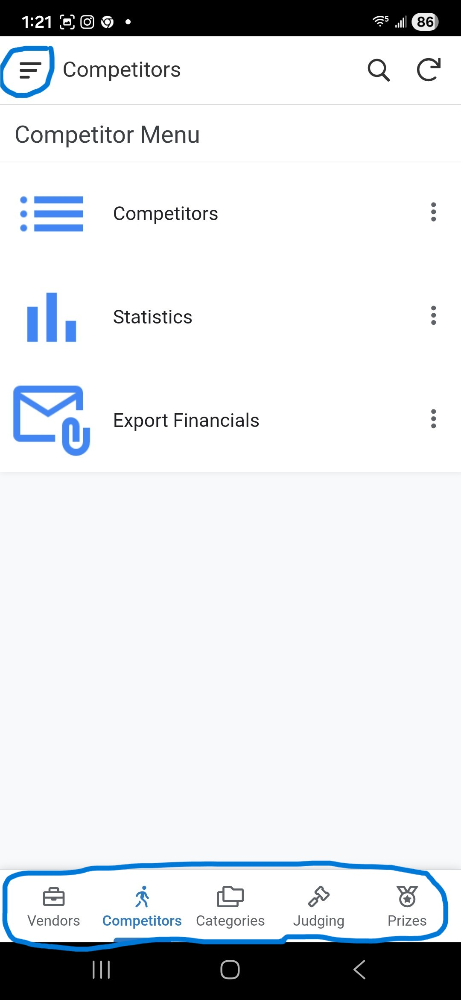
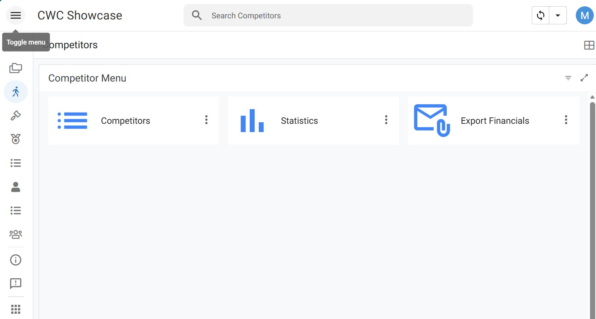

# General Navigation

This guide explains how to move around the application, switch between modules, and navigate through different views.

## Accessing the Main Menu
The **Main Menu** is your primary way to navigate between different sections (modules) of the application.
- **Mobile/Small Screens**: Tap the **Hamburger Icon (≡)** in the top-left corner to open the side menu or you can use the quick buttons on the bottom of the screen (Vendors, Competitors, Categories, Judging or Prizes).

    

- **Desktop/Large Screens**: The menu will appear as a left sidebar.

    

## Opening a Module
To open a specific part of the application:
1. Open the **Main Menu**.
2. Tap on the desired **Module** (e.g., **Vendors**, **Competitors**, **Judging**, or **Users**).
3. Some modules may have sub-menus, but some do not (e.g., **Events** or **Users**).

## Switching Modules
If you are already inside a module and want to switch to another:
1. Tap the **Main Menu** icon (usually the Hamburger icon or the App Logo) in the top-left corner.
1. Select the new module from the list.  
1. On mobile only some modules show up onthe bottom of the screen.
1. The application will transition to the entry point of the selected module immediately.

## Navigating Backwards
To return to a previous screen:
- **Header Back Arrow**: In **Detail Views** or **Forms**, a **Back Arrow (←)** is typically located in the top-left corner of the header. Clicking this will take you back to the previous list or menu.
- **Cancel Button**: In forms, the **Cancel** button will discard changes and return you to the previous screen.
- **System Back Button**: On Android devices or browsers, the system "Back" button can also be used to return to the previous view.

## Standard Navigation Flow
Most tasks follow this pattern:
1. **Select Module** from the Main Menu.
2. **Select Item** from a List View to open the Detail View.
3. **Perform Action** (Edit, Check-In, etc.) which opens a Form.
4. **Save or Cancel** to return to the Detail View.
5. **Back Arrow** to return to the List View.
