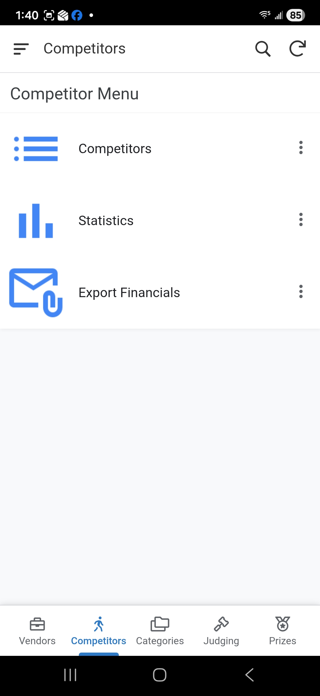
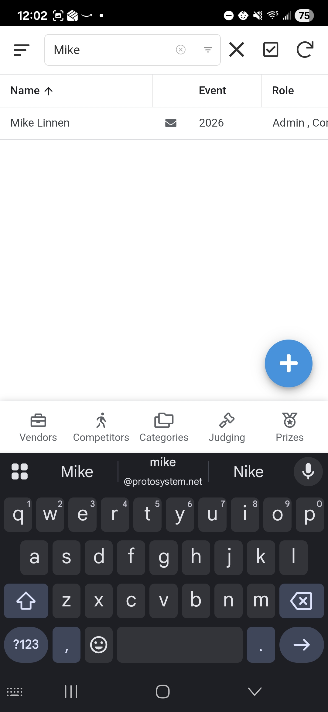
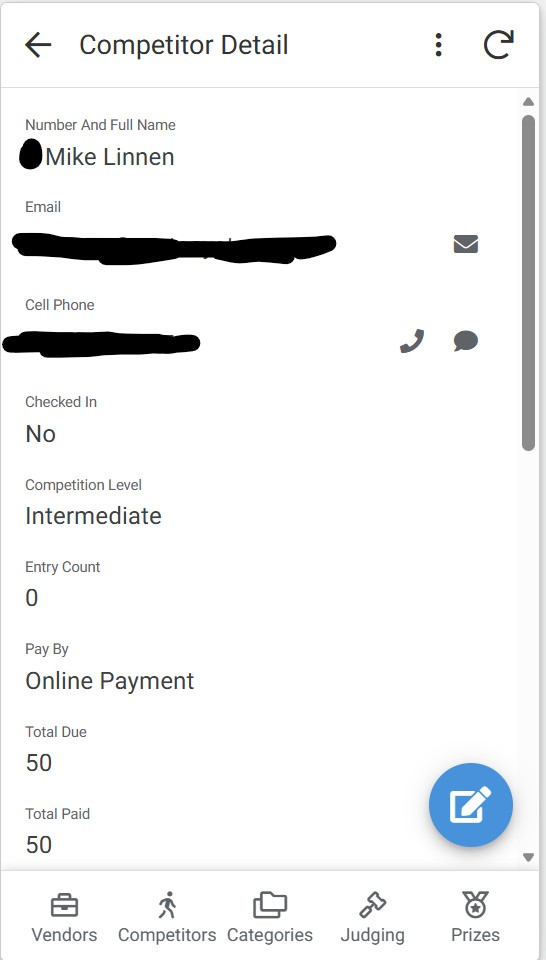
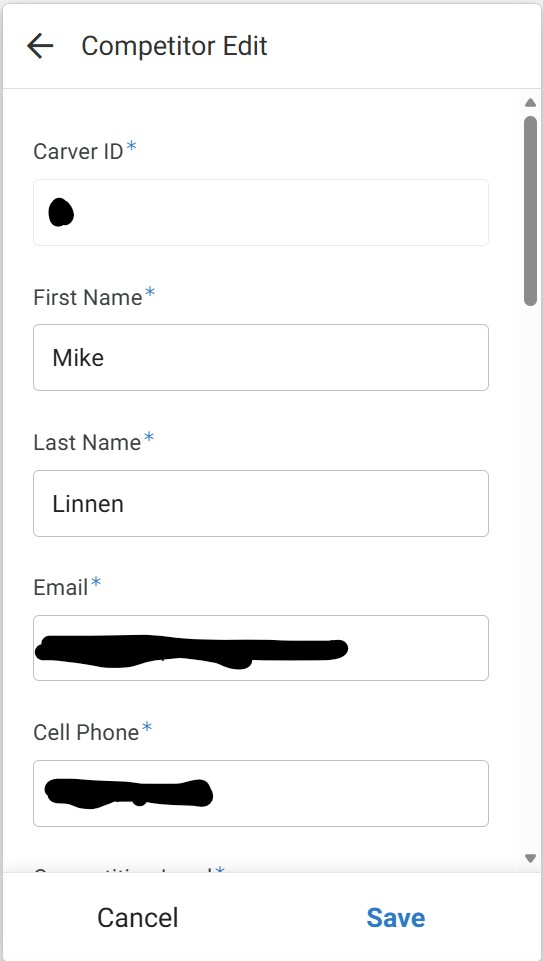

# Update Competitor Registration Details

This document outlines the process for updating a competitor's registration information and explains how these changes might affect their registration packet.  

If a competitor registered for an event with an invalid email then it is possible that the admin@charlottewoodcarvers.com email will get a bounce notification.  When this happens the competitor should be contacted by phone to aquire the correct email from them.  

A competitor might reach out to club members stating they never got the registration packet in their email box in which case we should verify which email they used during registration and correct it if it needs to be changed.  If their email looks correct in our records then instruct them to check thier spam folder.

The admin@charlottewoodcarvers.com email might receive a notification that the Online Payment link could not be created due to an invalid phone number.  If this happens then the competitor needs to be contacted by email to establish the correct phone number or ask them if they want to change their method of payment.

## 1. Accessing Competitor Details for Editing
1. From the **Main Menu**, select the **Competitors** module.
2. Select **Competitors** from the submenu.

    

## 2. Finding a Competitor
- A list of all registered competitors will be displayed.
- Use the **Search Bar** to find the competitor by entering their **Carver ID** or **Name**.

    

## 3. Opening the Competitor Detail Form
- Once you locate the competitor, click on their row and the detail form will open.

    

## 4. Opening the Competitor Edit Form
- On the detail form you click the **pencil icon** to edit the competitors information.

    

> ### ⚠️ WARNING: Some edits regenerate the competitors packet
> 
> Updating a competitor's Email or Phone number will trigger their registration packet to be re-processed:
> - A new PDF will be created overwriting the previous one
> - If they are doing an Online Payment then the payment link will be re-created.
> - An email will be sent to them with the new PDF.
>
>Any other updates to the competitors information will not re-generate their registration packet.  For example if you update their name or address the packet will not be re-generated.

If there are any other reasons the packet needs to be re-generated then contact Mike Linnen.

1.  Click the **Save** button to apply the changes.
    *   *Note: As with other forms, there is typically no confirmation message after clicking Save; the form will simply close.*

