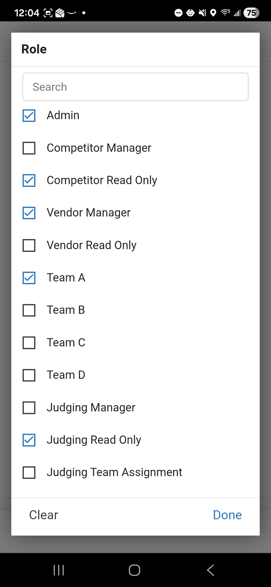

# User Management
This module is used to manage volunteer access to the application. Access is restricted to users assigned the **User Manager** role.
## 1. Accessing User Management
1. From the **Main Menu**, select the **Users** menu option.
2. The application will open directly to the **Users** list.

## 2. Adding a New User

To grant a new volunteer access, click the **Add** button and enter the following:

- **Email**: Must be a valid email address.
- **Name**: The volunteer's full name.
- **Role**: Select the appropriate role (e.g., Check-In, Judging, Finance). Note that permissions are tied to these roles.
- **Event**: Assign the user to the current competition event.

### Important: Google Account & AppSheet Access
The application uses Google for authentication. Please keep the following in mind:
1. **Google Account**: The email address provided **must** be associated with a Google Account.
2. **Account Setup**: If the volunteer does not have a Google account, they must create one before they can log in.
3. **AppSheet Sharing**: Adding a user to this module does not automatically grant them access to the app. An Administrator must also **share the AppSheet application** with the user's email address through the AppSheet editor.
4. **Passwords**: The application does not manage passwords. Users manage their own password and security settings directly through their Google Account.

## 3. Managing Roles

Users can be assigned multiple roles. These roles determine which modules (like Judging or Finance) are visible and editable when they log in. 

### Available Roles
The following roles can be assigned to users to control their level of access within the application:

| Role | Description |
| --- | --- |
| **Admin** | Full access to all modules, settings, and administrative functions. |
| **Competitor Manager** | Can add, edit, and manage all competitor registrations and check-ins. |
| **Competitor Read Only** | Can view competitor information but cannot make changes. |
| **Vendor Manager** | Can add, edit, and manage all vendor registrations and assignments. |
| **Vendor Read Only** | Can view vendor information but cannot make changes. |
| **Team A, B, C, D** | Assigned to specific judging teams for entering results in their assigned categories. |
| **Judging Manager** | Can manage the entire judging process, including team and prize assignments. |
| **Judging Read Only** | Can view judging results but cannot enter or modify winners. |
| **Judging Team Assignment** | Specifically for assigning judging teams to categories. |
| **Manage Payments** | Can record transaction details and verify payments (Finance role). |
| **User Manager** | Can manage user accounts, permissions, and role assignments. |
| **User Read Only** | Can view user accounts and roles but cannot modify them. |
| **Category Manager** | Can configure competition divisions, categories, and styles. |
| **Category Read Only** | Can view category configurations but cannot modify them. |
| **Prize Manager** | Can configure and manage the available prizes and awards. |
| **Prize Read Only** | Can view prize information but cannot modify them. |
| **Event Manager** | Can define event details, dates, and registration windows. |
| **Event Read Only** | Can view event details but cannot modify them. |
| **Menu Manager** | Can configure and manage the application's navigation menus. |
| **Menu Read Only** | Can view menu configurations but cannot modify them. |

*Note: Users can be assigned multiple roles if they need access to several modules (e.g., both Judging and Competitor management).*

## 4. Saving Changes
- **Save**: Click the **Save** button to create or update the user. 
    - *Note: The form will close without a confirmation message.*
- **Cancel**: Click the **Cancel** button to exit without saving.
    - *Note: No confirmation prompt will appear.*
