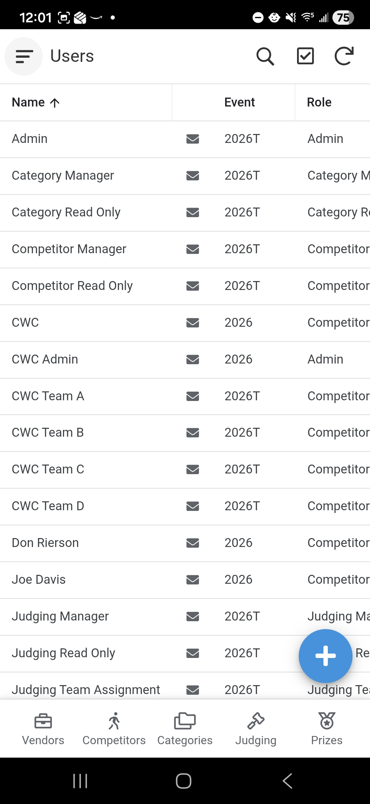
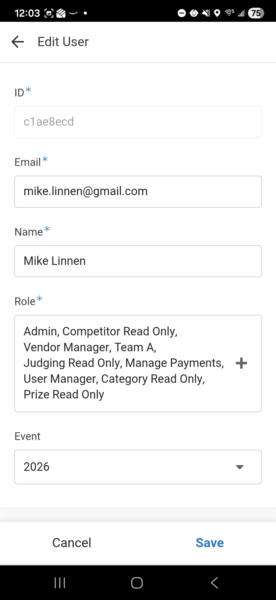

# User Management

This module is used to manage volunteer access to the application. Access is restricted to users assigned the **User Manager** role.

## 1. Accessing User Management
1. From the **Main Menu**, select the **User Management** module.
2. Select **Users** from the submenu.

## 2. Adding a New User

To grant a new volunteer access, click the **Add** button and enter the following:

- **Email**: Must be a valid email address.
- **Name**: The volunteer's full name.
- **Role**: Select the appropriate role (e.g., Check-In, Judging, Finance). Note that permissions are tied to these roles.
- **Event**: Assign the user to the current competition event.

### Important: Google Account & AppSheet Access
The application uses Google for authentication. Please keep the following in mind:
1. **Google Account**: The email address provided **must** be associated with a Google Account.
2. **Account Setup**: If the volunteer does not have a Google account, they must create one before they can log in.
3. **AppSheet Sharing**: Adding a user to this module does not automatically grant them access to the app. An Administrator must also **share the AppSheet application** with the user's email address through the AppSheet editor.
4. **Passwords**: The application does not manage passwords. Users manage their own password and security settings directly through their Google Account.

## 3. Managing Roles
Users can be assigned multiple roles. These roles determine which modules (like Judging or Finance) are visible and editable when they log in. Specific role definitions will be provided as the event configuration is finalized.

## 4. Saving Changes
- **Save**: Click the **Save** button to create or update the user. 
    - *Note: The form will close without a confirmation message.*
- **Cancel**: Click the **Cancel** button to exit without saving.
    - *Note: No confirmation prompt will appear.*
